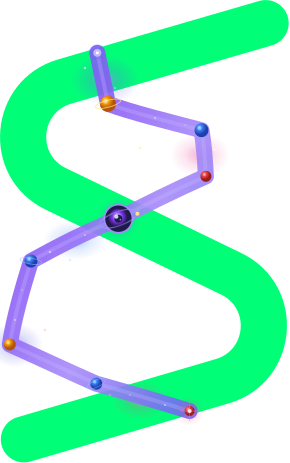
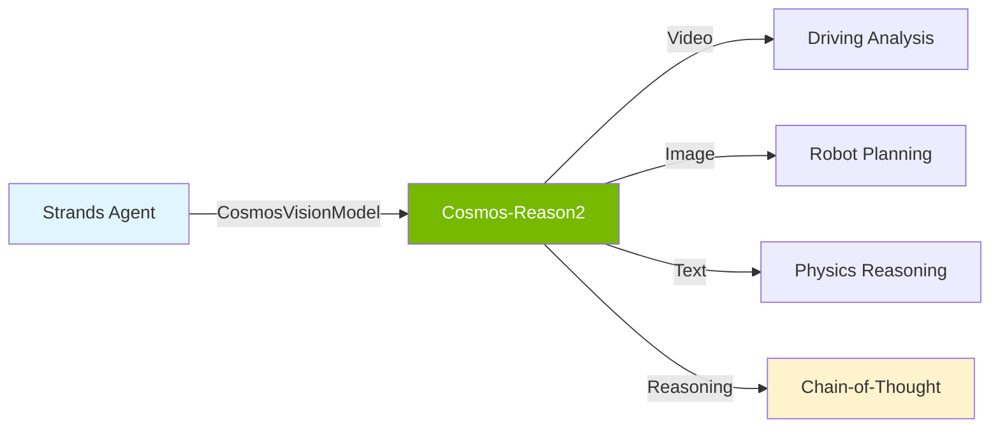

# strands-cosmos

[](https://pypi.org/project/strands-cosmos/)
[](https://cagataycali.github.io/strands-cosmos/)

<p align="center">
  
</p>

**NVIDIA Cosmos Reason VLM provider for [Strands Agents](https://strandsagents.com) — physical AI reasoning, video understanding, and embodied intelligence.**

Enables Strands agents to use [Cosmos-Reason2](https://github.com/nvidia-cosmos/cosmos-reason2) models for video captioning, driving analysis, robot planning, temporal reasoning, and physics understanding.

---

## Install

**Requirements:** Python ≥3.10, NVIDIA GPU (24GB+ for 2B, 32GB+ for 8B)

```bash
pip install strands-cosmos strands-agents
```

### NVIDIA Jetson (Thor, Orin, AGX)

On Jetson devices, PyTorch's pip-bundled CUBLAS may be incompatible with the GPU architecture. After installing, run the included fix:

```bash
pip install strands-cosmos strands-agents

# Fix CUBLAS (auto-detects if needed, safe to run on any platform)
strands-cosmos-fix-cublas

# Or check without fixing:
strands-cosmos-fix-cublas --check
```

<details>
<summary><strong>What does the CUBLAS fix do?</strong></summary>

PyTorch wheels ship their own `libcublas.so` which may not support Jetson GPU architectures (e.g., SM 11.0 on Thor, SM 8.7 on Orin). This causes `CUBLAS_STATUS_INVALID_VALUE` on any matrix multiplication (`torch.mm`, attention layers, linear layers, etc.).

The fix:
1. Backs up torch's bundled `libcublas.so` and `libcublasLt.so`
2. Copies the system CUBLAS from JetPack (`/usr/local/cuda/targets/*/lib/`)
3. Verifies the fix with a quick `torch.mm` test

To revert: `strands-cosmos-fix-cublas --revert`

**Affected:** Jetson AGX Thor (SM 11.0), may affect other Jetson devices with pre-release BSPs.
**Not affected:** Desktop GPUs (A100, H100, RTX 4090, etc.), x86_64 systems.
</details>

---

## Quick Start

```python
from strands import Agent
from strands_cosmos import CosmosVisionModel

model = CosmosVisionModel(model_id="nvidia/Cosmos-Reason2-2B")
agent = Agent(model=model)

# Video understanding
agent("Caption in detail: <video>dashcam.mp4</video>")

# Image reasoning
agent("<image>robot_view.jpg</image> What can be the next immediate action?")

# Text-only physics reasoning
agent("What happens when a ball rolls off a table?")
```

---

## Models

| Model | GPU Memory | Architecture |
|-------|-----------|--------------|
| [Cosmos-Reason2-2B](https://huggingface.co/nvidia/Cosmos-Reason2-2B) | 24GB | Qwen3-VL |
| [Cosmos-Reason2-8B](https://huggingface.co/nvidia/Cosmos-Reason2-8B) | 32GB | Qwen3-VL |

### Verified Platforms

| Platform | GPU | Status |
|----------|-----|--------|
| Jetson AGX Thor | NVIDIA Thor 132GB | ✅ (with CUBLAS fix) |
| Desktop | A100 / H100 / RTX 4090 | ✅ |
| Jetson Orin | Orin 32/64GB | ✅ (may need CUBLAS fix) |

---

## Features

### Video Understanding

```python
from strands_cosmos import CosmosVisionModel

model = CosmosVisionModel(
    model_id="nvidia/Cosmos-Reason2-2B",
    fps=4,                    # Video frame rate
    reasoning=True,           # Enable chain-of-thought
    params={"max_tokens": 4096, "temperature": 0.6},
)
```

### Chain-of-Thought Reasoning

```python
model = CosmosVisionModel(reasoning=True)
agent = Agent(model=model)

# Generates <think>reasoning</think> then answer
agent("<video>scene.mp4</video> Is this video physically plausible?")
```

### Built-in Task Prompts

```python
from strands_cosmos.cosmos_vision_model import TASK_PROMPTS

# Available tasks:
# caption, embodied_reasoning, driving, causal,
# temporal_localization, 2d_grounding, robot_cot,
# describe_anything, mvp_bench
```

### As a Tool (in any agent)

```python
from strands import Agent
from strands_cosmos import cosmos_vision_invoke

# Use Cosmos as a tool inside a Bedrock/OpenAI agent
agent = Agent(tools=[cosmos_vision_invoke])
agent("Analyze this dashcam video for safety: /path/to/video.mp4")
```

---

## Architecture

```
strands_cosmos/
├── cosmos_model.py          # Text-only CosmosModel (Strands Model interface)
├── cosmos_vision_model.py   # Vision CosmosVisionModel (video + image + text)
├── fix_cublas.py            # Jetson CUBLAS compatibility fix
└── tools/
    ├── cosmos_invoke.py         # Text inference tool
    └── cosmos_vision_invoke.py  # Vision inference tool
```



---

## Configuration

```python
model = CosmosVisionModel(
    model_id="nvidia/Cosmos-Reason2-8B",  # or 2B
    device_map="auto",                     # GPU placement
    torch_dtype="auto",                    # float16/bfloat16
    reasoning=True,                        # CoT reasoning
    fps=4,                                 # Video FPS
    min_vision_tokens=256,                 # Min visual tokens
    max_vision_tokens=8192,                # Max visual tokens
    params={
        "max_tokens": 4096,
        "temperature": 0.6,
        "top_p": 0.95,
    },
)
```

---

## Examples

| Example | Description |
|---------|-------------|
| [01_basic_text.py](examples/01_basic_text.py) | Text-only physics reasoning |
| [02_video_caption.py](examples/02_video_caption.py) | Video captioning |
| [03_driving_analysis.py](examples/03_driving_analysis.py) | Dashcam safety analysis with CoT |
| [04_embodied_reasoning.py](examples/04_embodied_reasoning.py) | Robot next-action prediction |
| [05_tool_usage.py](examples/05_tool_usage.py) | Cosmos as a tool in another agent |

---

## Capabilities

Cosmos-Reason2 excels at **physical world understanding**:

- 🚗 **Driving Analysis** — Traffic, hazards, navigation from dashcam video
- 🤖 **Robot Planning** — Next-action prediction, 2D trajectory planning
- 🎬 **Video Captioning** — Detailed temporal-spatial descriptions
- ⚛️ **Physics Reasoning** — Object permanence, causality, plausibility
- 🔍 **2D Grounding** — Bounding box localization in images
- 📍 **Temporal Localization** — Event timestamps in video
- 🧠 **Chain-of-Thought** — `<think>` reasoning before answers

---

## Troubleshooting

### `CUBLAS_STATUS_INVALID_VALUE` on Jetson

**Symptom:** Any `torch.mm()`, attention, or linear layer crashes with CUBLAS error.

**Cause:** PyTorch's pip-bundled `libcublas.so` doesn't support Jetson's GPU architecture.

**Fix:**
```bash
strands-cosmos-fix-cublas
```

This replaces torch's bundled CUBLAS with the system CUBLAS from JetPack. Safe and reversible (`--revert`).

### `StopIteration` in `get_rope_index` during video inference

**Symptom:** Crash in `modeling_qwen3_vl.py` when processing video with `transformers>=5.3.0`.

**Cause:** Breaking change in `transformers 5.3.0` for Qwen3-VL video RoPE position handling.

**Fix:** Already handled — `strands-cosmos` pins `transformers<5.3.0` in dependencies.

### Video decoding warnings (torchcodec / torchvision)

These are harmless warnings about deprecated video decoding. To silence them, install `torchcodec`:

```bash
pip install torchcodec
```

---

## Resources

- [Cosmos-Reason2 GitHub](https://github.com/nvidia-cosmos/cosmos-reason2)
- [HuggingFace Models](https://huggingface.co/collections/nvidia/cosmos-reason2)
- [Strands Agents](https://strandsagents.com)
- [strands-mlx](https://github.com/cagataycali/strands-mlx) (Apple Silicon provider)

---

## License

Apache 2.0 | Built with NVIDIA Cosmos-Reason2 and Strands Agents
