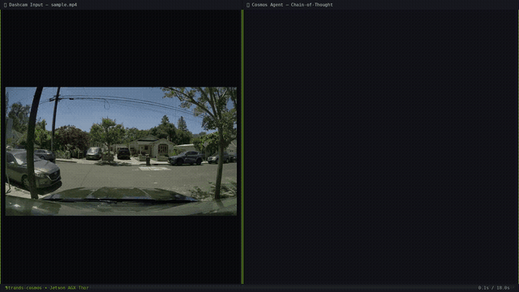

# strands-cosmos

[](https://pypi.org/project/strands-cosmos/)
[](https://cagataycali.github.io/strands-cosmos/)

[![Awesome Strands Agents](https://img.shields.io/badge/Awesome-Strands%20Agents-00FF77?style=flat-square&logo=data:image/svg+xml;base64,PHN2ZyB3aWR0aD0iMjkwIiBoZWlnaHQ9IjQ2MyIgdmlld0JveD0iMCAwIDI5MCA0NjMiIGZpbGw9Im5vbmUiIHhtbG5zPSJodHRwOi8vd3d3LnczLm9yZy8yMDAwL3N2ZyI+CjxwYXRoIGQ9Ik05Ny4yOTAyIDUyLjc4ODRDODUuMDY3NCA0OS4xNjY3IDcyLjIyMzQgNTYuMTM4OSA2OC42MDE3IDY4LjM2MTZDNjQuOTgwMSA4MC41ODQzIDcxLjk1MjQgOTMuNDI4MyA4NC4xNzQ5IDk3LjA1MDFMMjM1LjExNyAxMzkuNzc1QzI0NS4yMjMgMTQyLjc2OSAyNDYuMzU3IDE1Ni42MjggMjM2Ljg3NCAxNjEuMjI2TDMyLjU0NiAyNjAuMjkxQy0xNC45NDM5IDI4My4zMTYgLTkuMTYxMDcgMzUyLjc0IDQxLjQ4MzUgMzY3LjU5MUwxODkuNTUxIDQxMS4wMDlMMTkwLjEyNSA0MTEuMTY5QzIwMi4xODMgNDE0LjM3NiAyMTQuNjY1IDQwNy4zOTYgMjE4LjE5NiAzOTUuMzU1QzIyMS43ODQgMzgzLjEyMiAyMTQuNzc0IDM3MC4yOTYgMjAyLjU0MSAzNjYuNzA5TDU0LjQ3MzggMzIzLjI5MUM0NC4zNDQ3IDMyMC4zMjEgNDMuMTg3OSAzMDYuNDM2IDUyLjY4NTcgMzAxLjgzMUwyNTcuMDE0IDIwMi43NjZDMzA0LjQzMiAxNzkuNzc2IDI5OC43NTggMTEwLjQ4MyAyNDguMjMzIDk1LjUxMkw5Ny4yOTAyIDUyLjc4ODRaIiBmaWxsPSIjRkZGRkZGIi8+CjxwYXRoIGQ9Ik0yNTkuMTQ3IDAuOTgxODEyQzI3MS4zODkgLTIuNTc0OTggMjg0LjE5NyA0LjQ2NTcxIDI4Ny43NTQgMTYuNzA3NEMyOTEuMzExIDI4Ljk0OTIgMjg0LjI3IDQxLjc1NyAyNzIuMDI4IDQ1LjMxMzhMNzEuMTcyNyAxMDMuNjcxQzQwLjcxNDIgMTEyLjUyMSAzNy4xOTc2IDE1NC4yNjIgNjUuNzQ1OSAxNjguMDgzTDI0MS4zNDMgMjUzLjA5M0MzMDcuODcyIDI4NS4zMDIgMjk5Ljc5NCAzODIuNTQ2IDIyOC44NjIgNDAzLjMzNkwzMC40MDQxIDQ2MS41MDJDMTguMTcwNyA0NjUuMDg4IDUuMzQ3MDggNDU4LjA3OCAxLjc2MTUzIDQ0NS44NDRDLTEuODIzOSA0MzMuNjExIDUuMTg2MzcgNDIwLjc4NyAxNy40MTk3IDQxNy4yMDJMMjE1Ljg3OCAzNTkuMDM1QzI0Ni4yNzcgMzUwLjEyNSAyNDkuNzM5IDMwOC40NDkgMjIxLjIyNiAyOTQuNjQ1TDQ1LjYyOTcgMjA5LjYzNUMtMjAuOTgzNCAxNzcuMzg2IC0xMi43NzcyIDc5Ljk4OTMgNTguMjkyOCA1OS4zNDAyTDI1OS4xNDcgMC45ODE4MTJaIiBmaWxsPSIjRkZGRkZGIi8+Cjwvc3ZnPgo=&logoColor=white)](https://github.com/cagataycali/awesome-strands-agents)

<p align="center">
  
</p>

**NVIDIA Cosmos toolkit for [Strands Agents](https://strandsagents.com) — from VLM reasoning to world-model generation, edge deployment, and evaluation.**

Provides Cosmos-Reason2 as a Strands model provider plus **21 tools** covering the entire NVIDIA Cosmos ecosystem: inference, video generation (Predict2.5), video-to-video (Transfer2.5), data curation (Xenna), post-training, distillation, quantization, edge deployment, and evaluation.

---

## Demo

> **Dashcam safety analysis with Chain-of-Thought reasoning on Jetson AGX Thor**

<a href="https://github.com/cagataycali/strands-cosmos/releases/download/v0.1.1/strands-cosmos-demo.mp4">
  
</a>

---

## Install

```bash
pip install strands-cosmos
```

### Developer Setup

```bash
git clone https://github.com/cagataycali/strands-cosmos && cd strands-cosmos
just setup-full    # Installs system deps, Python deps, clones all Cosmos repos
just doctor        # Verify everything
```

### NVIDIA Jetson (Thor, Orin, AGX)

```bash
pip install strands-cosmos
strands-cosmos-fix-cublas   # Fix CUBLAS for Jetson GPU architecture
```

---

## Quick Start

```python
from strands import Agent
from strands_cosmos import CosmosVisionModel

model = CosmosVisionModel(model_id="nvidia/Cosmos-Reason2-2B")
agent = Agent(model=model)

# Video understanding
agent("Caption in detail: <video>dashcam.mp4</video>")

# Image reasoning
agent("<image>robot_view.jpg</image> What should the robot do next?")

# Text-only physics reasoning
agent("What happens when a ball rolls off a table?")
```

---

## Tools

Use any tool inside a Strands Agent for full Cosmos pipeline automation:

| Category | Tools | Description |
|----------|-------|-------------|
| **Reason2 VLM** | `cosmos_inference`, `cosmos_reason_hf`, `cosmos_serve` | TRT server inference, HF direct inference, server lifecycle |
| **Predict 2.5** | `cosmos_predict_generate` | World-model video generation (future frame prediction) |
| **Transfer 2.5** | `cosmos_transfer_generate` | ControlNet video-to-video (depth/edge/sketch→video) |
| **Model Lifecycle** | `cosmos_model_download`, `cosmos_quantize`, `cosmos_export_onnx`, `cosmos_build_engine` | Download, FP8 quantize, ONNX export, TRT engine build |
| **Training** | `cosmos_post_train`, `cosmos_distill` | SFT/LoRA post-training, knowledge distillation |
| **Data** | `cosmos_curate` | Xenna data curation pipeline |
| **Evaluation** | `cosmos_evaluate` | FID/FVD/CSE/CLIP benchmark evaluation |
| **I/O** | `rtp_capture_frame`, `nats_publish`, `video_probe`, `video_extract_frames`, `image_read` | RTP capture, NATS messaging, video/image utilities |
| **System** | `cosmos_sysinfo` | GPU/platform diagnostics |

```python
from strands import Agent
from strands_cosmos import cosmos_reason_hf, video_probe, cosmos_sysinfo

agent = Agent(tools=[cosmos_reason_hf, video_probe, cosmos_sysinfo])
agent("Check the system, then analyze the video at /tmp/scene.mp4")
```

---

## Models

| Model | GPU Memory | Use Case |
|-------|-----------|----------|
| [Cosmos-Reason2-2B](https://huggingface.co/nvidia/Cosmos-Reason2-2B) | 24GB | Edge deployment (Jetson Thor/Orin) |
| [Cosmos-Reason2-8B](https://huggingface.co/nvidia/Cosmos-Reason2-8B) | 32GB | Cloud/desktop high-accuracy |

### Performance (Jetson AGX Thor, Reason2-2B)

| Task | Load Time | Generation |
|------|-----------|-----------|
| Text inference | 7s | **1.4s** (46 tokens) |
| Video caption | 7s | **2.2s** (short clip @ 4fps) |

---

## Architecture

```
strands_cosmos/
├── cosmos_model.py              # CosmosModel (text-only Strands Model)
├── cosmos_vision_model.py       # CosmosVisionModel (video+image+text)
├── fix_cublas.py                # Jetson CUBLAS compatibility fix
├── tools/                       # 21 tools (full Cosmos pipeline)
│   ├── inference.py             # TRT server inference
│   ├── reason_hf.py            # HF Transformers direct inference
│   ├── serve.py                # Server lifecycle management
│   ├── predict_generate.py     # Predict2.5 world model
│   ├── transfer_generate.py    # Transfer2.5 ControlNet
│   ├── model_download.py       # HF model download
│   ├── quantize.py             # FP8 quantization
│   ├── export_onnx.py          # ONNX export
│   ├── build_engine.py         # TRT engine build
│   ├── post_train.py           # Post-training (SFT/LoRA)
│   ├── distill.py              # Knowledge distillation
│   ├── curate.py               # Xenna data curation
│   ├── evaluate.py             # Benchmark evaluation
│   ├── rtp.py                  # GStreamer RTP capture
│   ├── nats_pub.py             # NATS publish
│   ├── video_utils.py          # ffprobe + frame extraction
│   ├── image_read.py           # Base64 image read
│   └── sysinfo.py              # System diagnostics
└── justfile                     # Developer workflow automation
```

---

## Justfile (Developer Workflow)

```bash
just setup          # Clone all 6 Cosmos ecosystem repos
just setup-full     # Full setup: system deps + Python + repos + diagnostics
just doctor         # Check repos, tools, GPU, platform compatibility
just install-trt-edge-llm  # Build TensorRT-Edge-LLM from source (Jetson)

# Run pipelines
just predict-generate config.json
just transfer-generate config.json
just evaluate metrics.json
just serve-start
```

---

## Configuration

```python
model = CosmosVisionModel(
    model_id="nvidia/Cosmos-Reason2-8B",
    device_map="auto",
    torch_dtype="auto",
    reasoning=True,           # Chain-of-thought <think>...</think>
    fps=4,                    # Video sampling rate
    min_vision_tokens=256,
    max_vision_tokens=8192,
    params={"max_tokens": 4096, "temperature": 0.6},
)
```

---

## Verified Platforms

| Platform | GPU | Status |
|----------|-----|--------|
| Jetson AGX Thor | NVIDIA Thor 132GB | ✅ (with CUBLAS fix) |
| Jetson Orin | 32/64GB | ✅ (may need CUBLAS fix) |
| Desktop | A100 / H100 / RTX 4090 | ✅ |
| Cloud | Any CUDA 12+ GPU | ✅ |

---

## Troubleshooting

### `CUBLAS_STATUS_INVALID_VALUE` on Jetson
```bash
strands-cosmos-fix-cublas    # Replaces torch's bundled CUBLAS with JetPack system CUBLAS
```

### `StopIteration` in `get_rope_index` during video
Already handled — `strands-cosmos` pins `transformers<5.3.0`. If you see this, run:
```bash
pip install "transformers>=4.57.0,<5.3.0"
```

### TRT tools return exit 127
Expected on workstations — those tools run on Jetson or in TRT Docker. Run `just doctor` to see what works on your machine.

---

## Resources

- [Cosmos Cookbook](https://github.com/nvidia-cosmos/cosmos-cookbook) — Official recipes
- [Cosmos-Reason2](https://github.com/nvidia-cosmos/cosmos-reason2) — VLM source
- [Strands Agents](https://strandsagents.com) — Agent framework
- [strands-mlx](https://github.com/cagataycali/strands-mlx) — Apple Silicon provider

---

## License

Apache 2.0 | Built with NVIDIA Cosmos and Strands Agents
