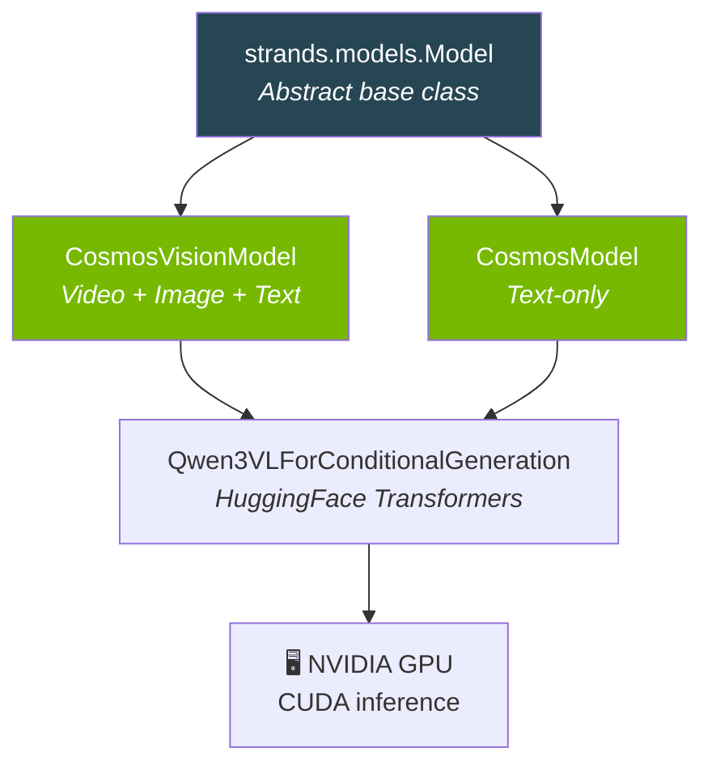
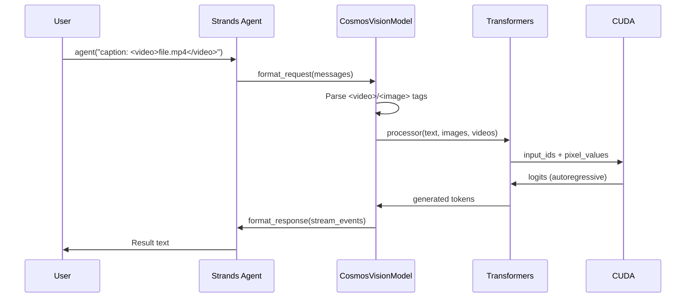
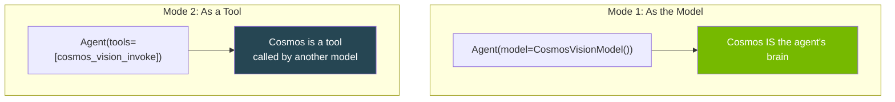

# Architecture

How strands-cosmos is structured internally.

---

## Package Structure

```
strands_cosmos/
├── __init__.py                  # Exports: CosmosModel, CosmosVisionModel, tools
├── cosmos_model.py              # Text-only model (Strands Model interface)
├── cosmos_vision_model.py       # Vision model (video + image + text)
├── fix_cublas.py                # Jetson CUBLAS compatibility fix
└── tools/
    ├── __init__.py              # Tool exports
    ├── cosmos_invoke.py         # Text inference tool (@tool decorated)
    └── cosmos_vision_invoke.py  # Vision inference tool (@tool decorated)
```

## Model Hierarchy



## Data Flow



## Two Usage Modes



## Strands Model Interface

`CosmosVisionModel` implements the full [Strands Model interface](https://strandsagents.com):

| Method | Purpose |
|--------|---------|
| `update_config()` | Merge user config |
| `get_config()` | Return current config |
| `format_request()` | Convert messages → HF inputs |
| `format_chunk()` | Stream tokens → StreamEvents |
| `format_response()` | Finalize response metadata |

## Configuration

```python
CosmosVisionModel(
    # Model selection
    model_id="nvidia/Cosmos-Reason2-2B",  # HuggingFace ID

    # GPU settings
    device_map="auto",        # GPU placement
    torch_dtype="auto",       # float16 / bfloat16

    # Vision settings
    fps=4,                    # Video frame sampling rate
    min_vision_tokens=256,    # Min visual tokens per frame
    max_vision_tokens=8192,   # Max visual tokens per frame

    # Reasoning
    reasoning=True,           # Enable <think> CoT

    # Generation
    params={
        "max_tokens": 4096,
        "temperature": 0.6,
        "top_p": 0.95,
    },
)
```
