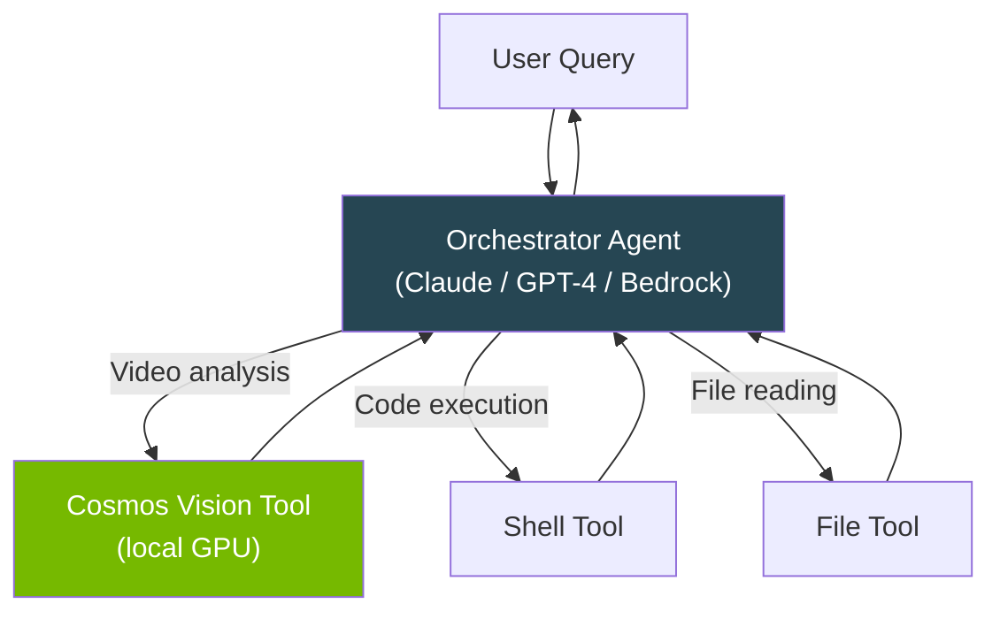

# Tool Usage

Use Cosmos as a **tool** inside any Strands agent — Bedrock, Anthropic, OpenAI, Ollama, or any other provider.

---

## How It Works


The orchestrating agent (cloud-based) decides *when* to call Cosmos. Cosmos runs **locally on GPU** for vision inference. Results flow back to the orchestrating agent.

## Vision Tool

```python
from strands import Agent
from strands_cosmos import cosmos_vision_invoke

# Cosmos as a tool inside a cloud agent
agent = Agent(tools=[cosmos_vision_invoke])

# The agent decides when to invoke Cosmos
agent("Analyze this dashcam video for safety: /path/to/video.mp4")
```

The tool accepts:

| Parameter | Type | Description |
|-----------|------|-------------|
| `prompt` | str | The question to ask about the media |
| `media_path` | str | Path to video or image file |
| `model_id` | str | HuggingFace model ID (optional) |

## Text-Only Tool

```python
from strands import Agent
from strands_cosmos import cosmos_invoke

agent = Agent(tools=[cosmos_invoke])
agent("Using the Cosmos model, explain what happens when two magnets approach each other")
```

## Both Tools Together

```python
from strands import Agent
from strands_cosmos import cosmos_invoke, cosmos_vision_invoke

agent = Agent(tools=[cosmos_invoke, cosmos_vision_invoke])

# The agent picks the right tool automatically
agent("What happens in this video? /path/to/clip.mp4")
agent("Explain Newton's third law")
```

## Multi-Agent Architecture



---

## What's Next

- [**Quickstart**](../getting-started/quickstart.md) — Basic setup
- [**Jetson Deployment**](jetson.md) — Run tools on edge hardware
