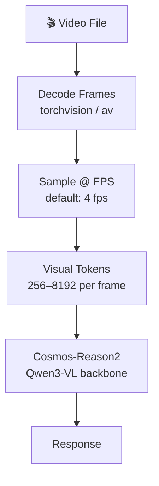

# Video Understanding

Cosmos-Reason2 processes video at configurable frame rates, extracting temporal and spatial information.

---

## How Video Processing Works



## Basic Video Captioning

```python
from strands import Agent
from strands_cosmos import CosmosVisionModel

model = CosmosVisionModel(
    model_id="nvidia/Cosmos-Reason2-2B",
    fps=4,
    params={"max_tokens": 4096},
)
agent = Agent(model=model)

agent("Caption this video in detail: <video>scene.mp4</video>")
```

## Configuring Frame Rate

Higher FPS = more detail but more GPU memory and slower inference.

| FPS | Frames (10s video) | Use Case |
|-----|-------------------|----------|
| 1 | 10 | Quick summaries |
| 4 | 40 | **Default — balanced** |
| 8 | 80 | Detailed temporal analysis |

```python
model = CosmosVisionModel(fps=8)  # Higher detail
```

## Controlling Visual Token Budget

```python
model = CosmosVisionModel(
    min_vision_tokens=256,   # Minimum per frame
    max_vision_tokens=8192,  # Maximum per frame
)
```

## Built-in Task Prompts

Cosmos includes optimized prompts for common tasks:

| Task Key | Description |
|----------|-------------|
| `caption` | Detailed video/image captioning |
| `driving` | Dashcam driving analysis |
| `embodied_reasoning` | Robot next-action prediction |
| `causal` | Physical cause-and-effect reasoning |
| `temporal_localization` | Event timestamps in video |
| `2d_grounding` | Bounding box localization |
| `robot_cot` | Step-by-step robot planning |

```python
from strands_cosmos.cosmos_vision_model import TASK_PROMPTS

# Use a task prompt directly
prompt = TASK_PROMPTS["driving"]
agent(f"{prompt} <video>dashcam.mp4</video>")
```

## Driving Analysis Example

```python
model = CosmosVisionModel(
    model_id="nvidia/Cosmos-Reason2-2B",
    reasoning=True,
    fps=4,
    params={"max_tokens": 4096, "temperature": 0.6},
)
agent = Agent(model=model)

agent("""<video>highway.mp4</video>
You are an expert driving assistant. Analyze:
1. Current road conditions
2. Potential hazards
3. Recommended actions for the driver""")
```

---

## What's Next

- [**Image Reasoning**](image-reasoning.md) — Single-frame analysis
- [**Chain-of-Thought**](chain-of-thought.md) — Enable step-by-step reasoning
- [**Examples**](../examples/overview.md) — Runnable code for all scenarios
