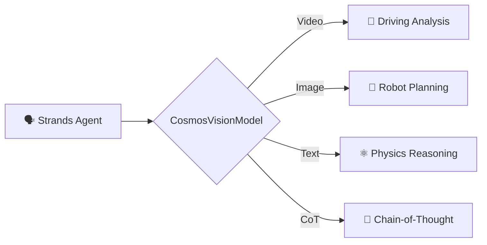

<div align="center">
  <h1>🌌 Strands Cosmos</h1>
</div>

> **Give your AI agent eyes that understand physics.**

NVIDIA Cosmos Reason VLM provider for [Strands Agents](https://strandsagents.com) — physical AI reasoning, video understanding, and embodied intelligence.

---

## What is Strands Cosmos?

Strands Cosmos is a Python package that connects [Strands Agents](https://github.com/strands-agents/sdk-python) to [NVIDIA Cosmos-Reason2](https://github.com/nvidia-cosmos/cosmos-reason2) — a family of vision-language models purpose-built for **physical world understanding**.

**2 models · Video + Image + Text · Chain-of-Thought reasoning · Tool integration · Jetson-native**



---

## Get Started in 2 Minutes

```bash
pip install strands-cosmos strands-agents
```

```python
from strands import Agent
from strands_cosmos import CosmosVisionModel

model = CosmosVisionModel(model_id="nvidia/Cosmos-Reason2-2B")
agent = Agent(model=model)

# Analyze a dashcam video
agent("Caption in detail: <video>dashcam.mp4</video>")

# Reason about a robot's view
agent("<image>robot_view.jpg</image> What should the robot do next?")

# Physics understanding (text-only)
agent("What happens when you push a ball off the edge of a table?")
```

→ **[Full Quickstart](getting-started/quickstart.md)** | **[Installation](getting-started/installation.md)**

---

## Capabilities

Cosmos-Reason2 excels at **physical world understanding**:

<div class="grid cards" markdown>

- **🚗 Driving Analysis**

    Traffic, hazards, navigation from dashcam video

- **🤖 Robot Planning**

    Next-action prediction, 2D trajectory planning

- **🎬 Video Captioning**

    Detailed temporal-spatial descriptions

- **⚛️ Physics Reasoning**

    Object permanence, causality, plausibility

- **🔍 2D Grounding**

    Bounding box localization in images

- **🧠 Chain-of-Thought**

    `<think>` reasoning before answers

</div>

---

## Models

| Model | GPU Memory | Architecture | Best For |
|-------|-----------|--------------|----------|
| [Cosmos-Reason2-2B](https://huggingface.co/nvidia/Cosmos-Reason2-2B) | 24 GB | Qwen3-VL | Edge / Jetson |
| [Cosmos-Reason2-8B](https://huggingface.co/nvidia/Cosmos-Reason2-8B) | 32 GB | Qwen3-VL | Desktop / Cloud |

### Verified Platforms

| Platform | GPU | Status |
|----------|-----|--------|
| Jetson AGX Thor | Thor 132 GB | ✅ (with CUBLAS fix) |
| Desktop | A100 / H100 / RTX 4090 | ✅ |
| Jetson Orin | Orin 32/64 GB | ✅ (may need CUBLAS fix) |

---

## Two Ways to Use

=== "As the Agent's Model"
    ```python
    from strands import Agent
    from strands_cosmos import CosmosVisionModel

    model = CosmosVisionModel(model_id="nvidia/Cosmos-Reason2-2B")
    agent = Agent(model=model)
    agent("Describe this scene: <video>scene.mp4</video>")
    ```

=== "As a Tool (in any Agent)"
    ```python
    from strands import Agent
    from strands_cosmos import cosmos_vision_invoke

    # Use Cosmos as a tool inside a Bedrock/OpenAI agent
    agent = Agent(tools=[cosmos_vision_invoke])
    agent("Analyze this dashcam video for safety: /path/to/video.mp4")
    ```

---

## Quick Links

<div class="grid" markdown>

[:material-download: **Installation** →](getting-started/installation.md)

[:material-rocket-launch: **Quickstart** →](getting-started/quickstart.md)

[:material-video: **Video Understanding** →](guide/video-understanding.md)

[:material-brain: **Chain-of-Thought** →](guide/chain-of-thought.md)

[:material-tools: **Tool Usage** →](guide/tool-usage.md)

[:material-chip: **Jetson Deployment** →](guide/jetson.md)

[:material-file-tree: **Architecture** →](architecture.md)

[:material-code-tags: **Examples** →](examples/overview.md)

</div>

---

## Resources

- [Cosmos-Reason2 GitHub](https://github.com/nvidia-cosmos/cosmos-reason2)
- [HuggingFace Models](https://huggingface.co/collections/nvidia/cosmos-reason2)
- [Strands Agents](https://strandsagents.com)
- [PyPI Package](https://pypi.org/project/strands-cosmos/)
