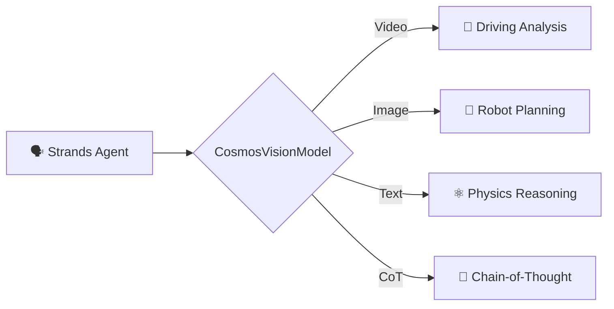

<div align="center">
  
  <h1>Strands Cosmos</h1>
  <p><strong>Give your AI agent eyes that understand physics.</strong></p>
</div>

NVIDIA Cosmos Reason VLM provider for [Strands Agents](https://strandsagents.com) — physical AI reasoning, video understanding, and embodied intelligence.



---

## See It In Action

<div class="grid cards" markdown>

- **🚗 Driving Analysis with Chain-of-Thought**

    

    → [Full example + code](examples/driving.md)

- **🤖 Robot Embodied Reasoning**

    

    → [Full example + code](examples/embodied.md)

</div>

<div class="grid cards" markdown>

- **🎬 Video Captioning**

    

    → [Full example + code](examples/video-caption.md)

- **⚛️ Physics Reasoning (Text-Only)**

    

    → [Full example + code](examples/basic-text.md)

</div>

!!! tip "Play locally"
    ```bash
    pip install asciinema
    asciinema play docs/assets/casts/03_driving_analysis.cast
    ```

---

## What is Strands Cosmos?

Strands Cosmos is the **full-lifecycle NVIDIA Cosmos toolkit** for [Strands Agents](https://github.com/strands-agents/sdk-python). It provides Cosmos-Reason2 as a model provider plus **21 tools** covering the entire ecosystem: VLM reasoning, world-model generation (Predict2.5), video-to-video (Transfer2.5), data curation (Xenna), post-training, quantization, edge deployment, and evaluation.

**2 models · 21 tools · Video + Image + Text · Chain-of-Thought · Jetson-native · Full pipeline automation**



---

## Get Started in 2 Minutes

```bash
pip install strands-cosmos
```

```python
from strands import Agent
from strands_cosmos import CosmosVisionModel

model = CosmosVisionModel(model_id="nvidia/Cosmos-Reason2-2B")
agent = Agent(model=model)

# Analyze a dashcam video
agent("Caption in detail: <video>dashcam.mp4</video>")

# Reason about a robot's view
agent("<image>robot_view.jpg</image> What should the robot do next?")

# Physics understanding (text-only)
agent("What happens when you push a ball off the edge of a table?")
```

→ **[Full Quickstart](getting-started/quickstart.md)** | **[Installation](getting-started/installation.md)**

---

## Capabilities

<div class="grid cards" markdown>

- **🚗 Driving Analysis**

    Traffic, hazards, navigation from dashcam video

    → [Driving example](examples/driving.md)

- **🤖 Robot Planning**

    Next-action prediction, 2D trajectory planning

    → [Embodied reasoning](examples/embodied.md)

- **🎬 Video Captioning**

    Detailed temporal-spatial descriptions

    → [Video captioning](examples/video-caption.md)

- **⚛️ Physics Reasoning**

    Object permanence, causality, plausibility

    → [Text reasoning](examples/basic-text.md)

- **🔍 2D Grounding**

    Bounding box localization in images

- **🧠 Chain-of-Thought**

    `<think>` reasoning before answers

    → [CoT guide](guide/chain-of-thought.md)

</div>

---

## Models

| Model | GPU Memory | Architecture | Best For |
|-------|-----------|--------------|----------|
| [Cosmos-Reason2-2B](https://huggingface.co/nvidia/Cosmos-Reason2-2B) | 24 GB | Qwen3-VL | Edge / Jetson |
| [Cosmos-Reason2-8B](https://huggingface.co/nvidia/Cosmos-Reason2-8B) | 32 GB | Qwen3-VL | Desktop / Cloud |

### Verified Platforms

| Platform | GPU | Status |
|----------|-----|--------|
| Jetson AGX Thor | Thor 132 GB | ✅ (with CUBLAS fix) |
| Desktop | A100 / H100 / RTX 4090 | ✅ |
| Jetson Orin | Orin 32/64 GB | ✅ (may need CUBLAS fix) |

---

## Two Ways to Use

=== "As the Agent's Model"
    ```python
    from strands import Agent
    from strands_cosmos import CosmosVisionModel

    model = CosmosVisionModel(model_id="nvidia/Cosmos-Reason2-2B")
    agent = Agent(model=model)
    agent("Describe this scene: <video>scene.mp4</video>")
    ```

=== "As a Tool (in any Agent)"
    ```python
    from strands import Agent
    from strands_cosmos import cosmos_reason_hf, video_probe, cosmos_sysinfo

    # 21 tools available — use any combination
    agent = Agent(tools=[cosmos_reason_hf, video_probe, cosmos_sysinfo])
    agent("Check GPU status, probe the video, then describe what you see in /tmp/scene.mp4")
    ```

=== "Full Pipeline (Agent automates Cosmos)"
    ```python
    from strands import Agent
    from strands_cosmos import (
        cosmos_model_download, cosmos_quantize, cosmos_export_onnx,
        cosmos_build_engine, cosmos_serve, cosmos_inference,
    )

    # Agent orchestrates the full edge-deployment pipeline
    agent = Agent(tools=[
        cosmos_model_download, cosmos_quantize, cosmos_export_onnx,
        cosmos_build_engine, cosmos_serve, cosmos_inference,
    ])
    agent("Download Reason2-2B, quantize to FP8, export ONNX, build TRT engine, start server, and run a test query")
    ```

---

## Performance on Jetson AGX Thor

Benchmarks with Cosmos-Reason2-2B on 132GB unified memory:

| Example | Task | Time | Recording |
|---------|------|------|-----------|
| 01 | Text-only physics | ~11s | [:material-play: cast](assets/casts/01_basic_text.cast) |
| 02 | Video caption (10s @ 4fps) | ~15s | [:material-play: cast](assets/casts/02_video_caption.cast) |
| 03 | Driving analysis + CoT | ~16s | [:material-play: cast](assets/casts/03_driving_analysis.cast) |
| 04 | Embodied reasoning + CoT | ~43s | [:material-play: cast](assets/casts/04_embodied_reasoning.cast) |
| 05 | Tool invocation | ~9s | [:material-play: cast](assets/casts/05_tool_usage.cast) |

---

## Quick Links

<div class="grid" markdown>

[:material-download: **Installation** →](getting-started/installation.md)

[:material-rocket-launch: **Quickstart** →](getting-started/quickstart.md)

[:material-video: **Video Understanding** →](guide/video-understanding.md)

[:material-brain: **Chain-of-Thought** →](guide/chain-of-thought.md)

[:material-tools: **Tool Usage** →](guide/tool-usage.md)

[:material-chip: **Jetson Deployment** →](guide/jetson.md)

[:material-file-tree: **Architecture** →](architecture.md)

[:material-code-tags: **API Reference (21 tools)** →](api-reference.md)

</div>

---

## Developer Setup (Full Cosmos Ecosystem)

```bash
git clone https://github.com/cagataycali/strands-cosmos && cd strands-cosmos
just setup-full    # Installs apt deps, Python deps, clones 6 Cosmos repos
just doctor        # Platform diagnostics — what works on THIS machine
```

`just doctor` checks: repos, core tools, Python packages, media tools, TRT binaries, GPU/CUDA — with platform-aware guidance (workstation vs Jetson vs Docker).

---

## Resources

- [Cosmos-Reason2 GitHub](https://github.com/nvidia-cosmos/cosmos-reason2)
- [HuggingFace Models](https://huggingface.co/collections/nvidia/cosmos-reason2)
- [Strands Agents](https://strandsagents.com)
- [PyPI Package](https://pypi.org/project/strands-cosmos/)
